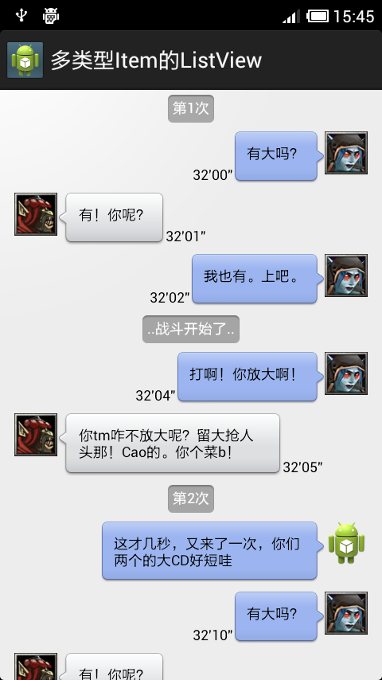

# 多类型Item的ListView

本项目代码基于 EOE 中[ListView有多种Item View的优化](http://www.eoeandroid.com/thread-329890-1-1.html)改善而来。

借助 Adapter 的 getTypeCount 方法来实现拥有多种类型的 Item 的 ListView 。借助接口来实现 Item 视图的分散，减少 Adapter 中 getView 的代码量，易于继承和扩展。

